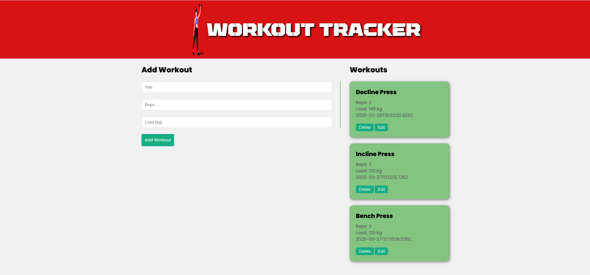

# MERN Project

This is a full-stack project built using the MERN stack (MongoDB, Express.js, React, and Node.js). It serves as a template for building modern web applications with a backend API and a frontend user interface.

## Features

- **Frontend**: Built with React for a dynamic and responsive user interface.
- **Backend**: Node.js and Express.js for handling API requests and business logic.
- **Database**: MongoDB for data storage and retrieval.
- **RESTful API**: Provides endpoints for CRUD operations.
- **Authentication**: Includes user authentication and authorization (if applicable).
- **State Management**: Uses React state or a library like Redux (if applicable).

